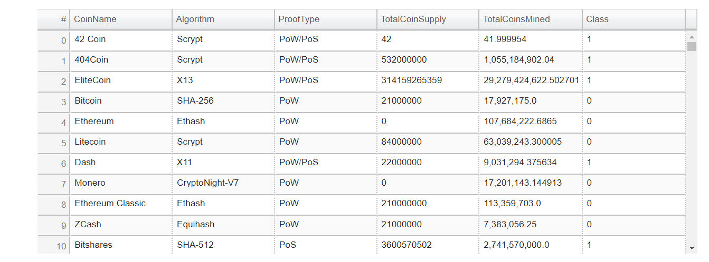

# Cryptocurrencies
Unsupervised Machine Learning
## Project Overview
The project requires to analyze the unlabled cyrptocurrencies data using unsupervised machine learning algorithm to understand what cryptocurrencies are on the trading market and how cryptocurrencies could be grouped toward creating a classification for developing this new investment product.
## Resources
- Data Source: cyrpto_data.csv
- Software: Pandas, Scikit-learn library, Python Plotly library, hvPlot visualization library and Jupyter notebook
## Challenge Overview
**1.Data Preprocessing:**

Once the data is loaded into the pandas dataframe , the data prepocessing steps include the following:

 a. Remove all cryptocurrencies that aren’t trading, whose algorithm are not defined and do not have coins mined.
 b. All the rows which has null values are dropped from the dataframe.
 c. The coulmns with the text values are encoded to their coresponding integer label.

**2. Reducing Data Dimensions Using PCA:**

In order to prepare the data for dimensions reduction , the data is scaled using the StandardScaler from sklearn, to standardize all of the data from  DataFrame. The  Principal Component Analysis PCA resulting algorithms from sklearn uses the scaled data to minimize this squared projection error and minimize the square distance between each point and the location of where it gets projected. The resulting data shows the reduced dimension form:

**3. Clustering Cryptocurrencies Using K-means:**

Predict clusters using cryptocurrencies data using the K-means algorithm form sklearn.We want to automatically group the data into clusters.It is the most widely used clustering algorithm.We will choose our cluster centroids based on the elbow curve method.

K-Means is an iterative algorithm and it does these steps of Randomly allocate points as cluster centroids, Cluster assignment and Move centroid. The elbow method curve helps us to determine the number of cluster which is 4 in our cyrptocurrencies. The following dataframe shows the class into which the data is clustered_df DataFrame.

**4. Visualizing Results**
The data visualization step shows the following using hvplot tables using the hvPlot visualization library to create a data table with all the current tradable cryptocurrencies.

The data visualization step shows the following 3D using Plotly Express to plot the clusters using the clustered_df DataFrame.

The data visualization step shows the following scatter plot using hvPlot visualization library to present the clustered data about cryptocurrencies having x="TotalCoinsMined" and y="TotalCoinSupply" to contrast the number of available coins versus the total number of mined coins.

